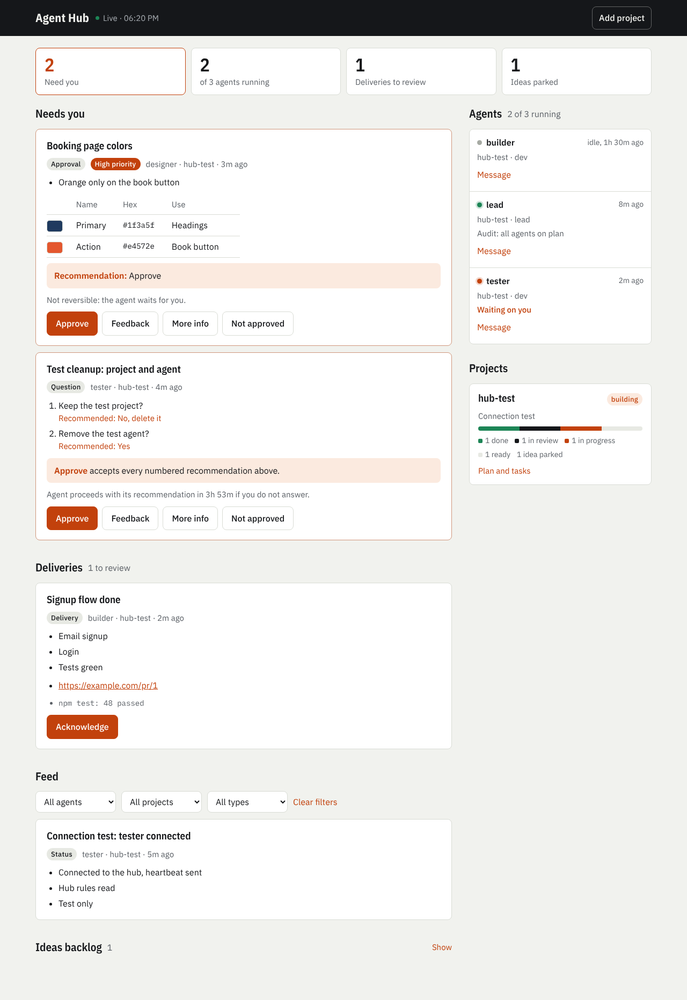

# Claude Agent Dashboard

One screen for all your Claude Code agents. Agents post progress, questions,
approvals and finished work to the dashboard. You answer there with one click and
never open their chats. A lead agent turns your brief into a plan, keeps every agent
on that plan and parks new ideas until the build is done.



Two versions:

- **Artifact version (easiest).** The dashboard is a private page on claude.ai. Nothing to
  install; works on your phone in the Claude app. Claude builds it for you.
- **Local version.** A small server on your own computer, with instant answer delivery
  through Claude Code hooks. Needs Node.js.

The full guide is the [manual](docs/MANUAL.md).

## Artifact version

**1. Let Claude build your hub.** Paste this into any Claude chat or Claude Code session:

```text
Set up the Agent Hub from https://github.com/giovannibrees/Claude-Dashboard for me:
1. Publish cloud/agent-hub.html as an artifact with the db and assets capabilities.
2. Replace HUB_URL_PLACEHOLDER in the page with the artifact's own URL and publish it again to the same URL.
3. Store the text of cloud/PROTOCOL.md in the artifact's database: collection "config", doc "protocol", field "text".
Then give me the link.
```

**2. Add a project.** Open the link, click **Add project**, give it a name, the agents
(`lead, builder`) and your brief. You get one start line per agent.

**3. Start the agents.** For each agent, open a Claude Code session on the project
(claude.ai/code, the desktop app or a terminal), switch it to auto mode and paste its start line.

The lead writes the plan and posts it to **Needs you**. Approve it and the agents start building.
For every other project: **Add project** on the same page and paste the new start lines.
Nothing needs to be installed in the projects themselves.

## Local version

You need [Node.js](https://nodejs.org) (LTS) and [Claude Code](https://code.claude.com).

**1. Get it**

```bash
git clone https://github.com/giovannibrees/Claude-Dashboard.git
```

**2. Start the dashboard**

Double-click **Start Dashboard.command** (Mac) or **Start Dashboard.bat** (Windows).
Your browser opens http://localhost:4747. Keep that window open.
If macOS refuses to open it, right-click the file and choose Open.

From a terminal it is `npm start` in the folder.

**3. Add a project**

On the dashboard, open **Add project** and fill in:

- **Project folder**: where the app should live, for example `/Users/you/Projects/gym-app`.
  The folder is created if it does not exist.
- **Agents**: `lead, builder` is a good start. Add `designer` or `builder-2` if you want more.
- **Brief**: everything the app needs: what it is, who it is for, must-have features,
  what is out of scope, deadline.

Click **Connect project**. The dashboard shows one line per agent to paste into a
Terminal window, and one start line to type into each Claude session. That is all.

### What happens next

1. The **lead** reads your brief, writes the plan and tasks, and posts the plan to
   **Needs you**. Approve it, or use Feedback to change it.
2. After approval, the agents build, task by task. They post a short status every 2 hours.
3. When an agent needs you, a card appears in **Needs you** with the agent's recommendation.
   Click **Approve**, **Feedback**, **More info** or **Not approved**. Your answer reaches the
   agent automatically.
4. Every 30 minutes the lead checks all agents: are they working, on topic, on plan,
   handing over properly, making mistakes. It corrects them itself and only flags you when it matters.
5. New ideas from the agents go to the **Ideas backlog**, never into the build.
6. Finished work shows up under **Deliveries** with links and proof it was tested.

### The dashboard

- **Agents**: green dot = working in the last 30 minutes, gray = idle. Shows current task,
  last status, token use, "Waiting on you" and loop warnings. **Message** sends an agent an instruction.
- **Projects**: phase (planning, building, complete), progress bar, the plan scope and the never-list.
- **Needs you**: questions and approvals, with a count badge (also in the browser tab title).
  Approve on a numbered card accepts all its recommendations. Feedback can answer per number:
  `1 yes, 2 no, 3 use option B`. Reversible decisions show a 4-hour clock: after that the agent
  goes with its own recommendation. Irreversible ones (deleting, paying, publishing, production data)
  always wait for you.
- **Deliveries**, **Lead agent flags**, **Feed** (everything, newest first) and **Ideas backlog**.
- Filters by agent, project and type.

### Use it from your phone

With [Tailscale](https://tailscale.com) on your computer and phone (same account):

```bash
tailscale serve --bg 4747
```

Then open `https://<your-computer>.<your-tailnet>.ts.net` on your phone (`tailscale serve status`
shows the address) and add it to your home screen. Only devices on your tailnet can reach it.
Stop sharing with `tailscale serve reset`.

### Good to know

- **Keeping agents running.** Agents keep going because they run inside `/loop`, which the
  start line includes. Claude Code ends a `/loop` after 7 days; type the start line again to continue.
- **First run of an agent.** Claude Code asks once whether you trust the project folder. Say yes,
  otherwise it keeps asking permission for the dashboard commands.
- **More agents in one folder** start with `HUB_AGENT=<name> claude`. The dashboard shows the exact line.
  Agents that edit the same files a lot work better in their own folder (a git worktree).
- **Keep the dashboard running all the time** (optional):
  `npm i -g pm2 && pm2 start server.js --name agent-dashboard && pm2 save && pm2 startup`.
- **Clean up** old items: `bin/hub cleanup` deletes archived items older than 30 days and logs
  older than 90. Add `--dry-run` to see what it would delete.
- **Private by default.** Your items, answers and logs stay in this folder and are never committed
  (see `.gitignore`). The server only listens on your own computer.
- **Windows.** The dashboard runs on Windows; the agent scripts need the Git Bash that Claude Code uses.

### Command line (optional)

Everything above works from the dashboard. If you prefer a terminal, run `npm link` once in
this folder and you get a `hub` command:

```bash
hub start                                   # start the dashboard
hub connect ~/Projects/gym-app --agents lead,builder --brief brief.md
hub status                                  # projects and agents
hub audit                                   # what the lead agent sees
```

Agents use `bin/post-item`, `bin/task`, `bin/my-inbox` and the other scripts in `bin/`.
You never need to; they are described in [AGENT-PROTOCOL.md](AGENT-PROTOCOL.md).

### How it works

```
inbox/        agents' open items (one JSON file each)
answers/      your answers (one JSON file per answered item)
archive/      answered, acknowledged and old items
log/          one append-only JSONL file per day
agents/       live state per agent (from Claude Code hooks)
projects/     plan, scope, never-list and tasks per project
directives/   instructions to agents from you or the lead
```

- `server.js` serves the dashboard and writes your answers. Plain Node, no packages.
- Connecting a project writes `.hub.json`, Claude Code hooks (`.claude/settings.json`) and an
  "Agent hub" section in the project's `CLAUDE.md`.
- The hooks keep each agent's state live, deliver your answers into the running agent after its
  next step, warn an agent that repeats the same command, count tokens, and tell an agent that still
  owns an unfinished task to keep going instead of stopping.
- [AGENT-PROTOCOL.md](AGENT-PROTOCOL.md) is the agents' rulebook: CEO-style bullets, max 5 per item,
  batched questions with a recommendation each, screenshots for UI, color tables for colors,
  plan-only work, the 4-hour rule, deliver and stop.
- [LEAD-AGENT.md](LEAD-AGENT.md) is the lead's playbook: planning from the brief, the 30-minute audit,
  reviewing work against the real code, and handling scope changes.

## License

MIT
